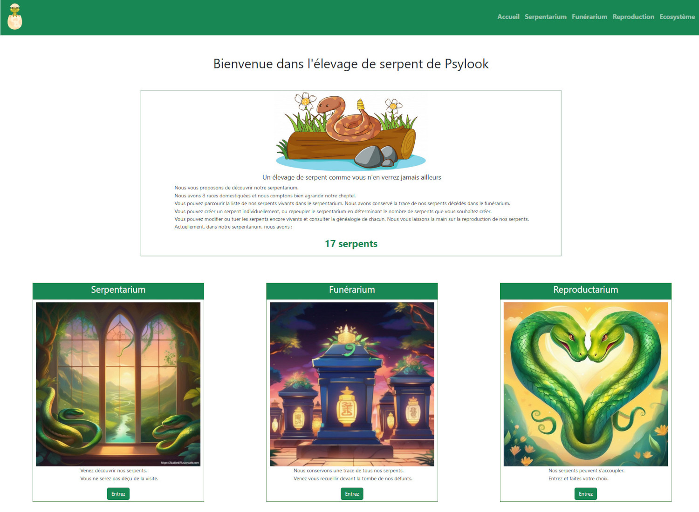
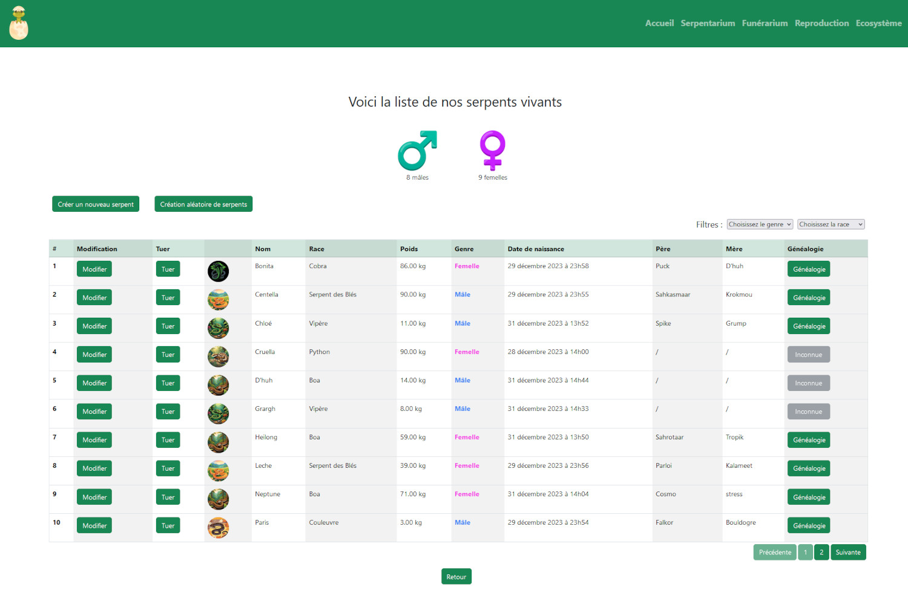
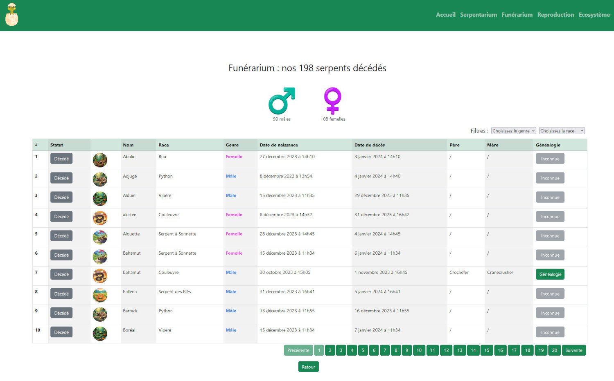
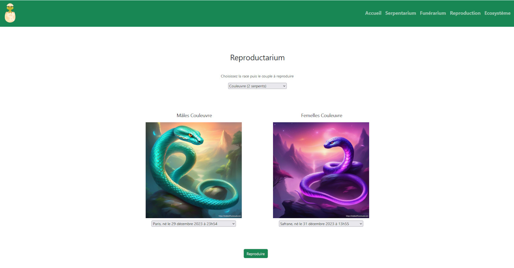

# Elevage de serpent

Un projet réalisé pour le cours de PHP.
<strong>Délais :</strong> environ 6 semaines.

## Langages utilisés
- HTML
- CSS
- MySQL
- PHP orienté objet
- Javascript/ajax

## Réalisations demandées
- Utiliser la programmation objet
- Créer la base de données (Schéma relationnel et script SQL)
- Afficher les serpents vivants (Serpentarium)
- Créer de nouveaux serpents : soit un serpent en entrant les données, soit plusieurs serpents aléatoirement
- Modifier des serpents vivants
- Tuer les serpents (mais les conserver en bdd)
- Afficher des serpents morts (Funérarium)
- Afficher le nombre de mâles et de femelles
- Pagination
- Filtres par genre et/ou race
- Faire s'accoupler un mâle et une femelle via la sélection
- Mort des serpents arrivés en fin de vie
- Afficher la généalogie d'un serpent

## Réalisations supplémentaires
- Affichage des dates en français
- Affichage du nom du père et de la mère

## Contraintes non réalisées
- Possibilité de trier la liste (sorting)
- Ecosystème : automatisation du cycle de vie des serpents (naissance, reproduction, mort, gestion en minutes)

<h2 style="text-align: center;">Images de l'élevage de serpent</h2>

<h4 style="text-align: center;">Accueil du site :</h4>

 

<h4 style="text-align: center;">Serpentarium :</h4>

 

<h4 style="text-align: center;">Funérarium :</h4>

 

<h4 style="text-align: center;">Reproductarium :</h4>

 